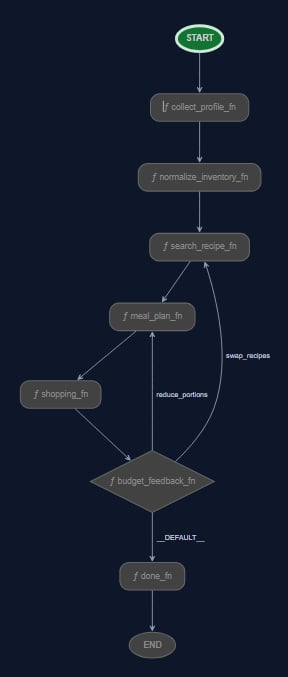

# 🥗 Smart Meal Planner with AI Nutrition Coach

An AI-powered personalized nutrition assistant built with Google ADK, Gemini, Cloud Run, and PostgreSQL that generates custom meal plans, intelligently manages grocery lists, and provides real-time dietary coaching.

---

## 📝 Short Description

This project orchestrates a team of specialized AI sub-agents to guide users through collecting profile preferences, auditing stock ingredients, searching recipes, building allergen-free daily meal plans, and compiling cost-optimized shopping lists. A deterministic security checkpoint sits in front of all LLM steps to intercept prompt injections, redact PII, and validate outputs.

---

## 🛠️ Technologies Used

| Layer | Stack |
|-------|-------|
| **Backend** | Python 3.11+, Google ADK 2.0, FastAPI, PostgreSQL / SQLAlchemy, Alembic, MCP |
| **Frontend** | React 19, TypeScript 6, Vite 8, Tailwind CSS 4, Zustand 5, Framer Motion |
| **Infrastructure** | Google Cloud Run, Cloud Build, Terraform, Artifact Registry |
| **External APIs** | FatSecret Platform API (OAuth 2.0), OpenRouter (optional fallback) |

---

## 🏗️ Architecture Overview



The system uses a sequential DAG workflow driven by a coordinator agent that manages transitions, maintains session state, and enforces safety gates. The coordinator delegates to specialized sub-agents and deterministic function nodes in a hybrid architecture.

---

## 📦 Repository Structure

```
meal-planner-assistant/    → Backend (Python ADK agents + FastAPI server)
  ├── app/                   Agents, tools, services, database models
  ├── mcp_servers/           MCP server definitions
  ├── scripts/               Validation & eval scripts
  ├── tests/                 Unit, integration, load, and eval tests
  └── deployment/            Terraform configs for GCP
meal-planner-ui/           → Frontend (React 19 + Vite + Tailwind)
  ├── src/pages/             11 pages
  ├── src/components/        UI primitives, domain components, layout
  └── src/stores/            Zustand state management
```

---

## 🚀 Quick Start

| Step | Command |
|------|---------|
| Backend setup | See [`meal-planner-assistant/README.md`](meal-planner-assistant/README.md) |
| Frontend setup | See [`meal-planner-ui/README.md`](meal-planner-ui/README.md) |
| Project writeup | See [`writeup.md`](writeup.md) |

---

## 🔗 Related Resources

- **Backend README** — installation, setup, API docs, agent architecture
- **Frontend README** — component patterns, routing, build & deploy
- **AGENTS.md** — agent orchestration, tool definitions, development commands
- **writeup.md** — comprehensive project documentation and design decisions
