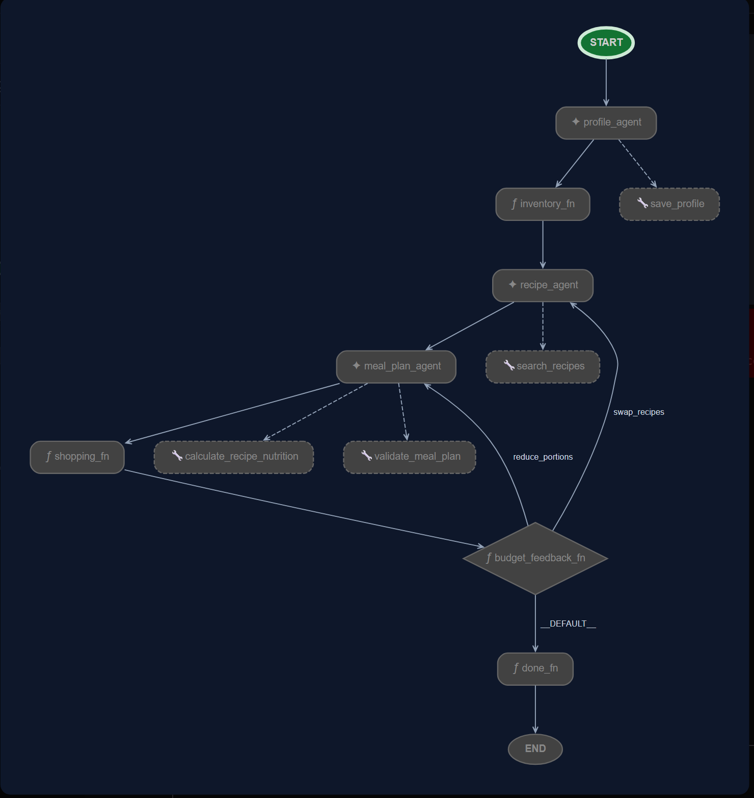

# 🥗 Agentic Meal Planner & Nutrition Assistant

An intelligent, multi-agent meal planning coordinator built on **Google's Agent Development Kit (ADK) 2.0** and the **Model Context Protocol (MCP)**. This system helps users design customized, budget-conscious, allergen-safe weekly meal plans while tracking nutritional intake.

---

## 📝 Short Description

This project orchestrates a team of specialized AI sub-agents to guide users through collecting profile preferences, auditing stock ingredients, searching recipes, building allergen-free daily meal plans, and compiling cost-optimized shopping lists. A deterministic security checkpoint sits in front of all LLM steps to intercept prompt injections, redact PII, and validate outputs.

---

## 🛠️ Technologies Used

*   **Core Logic**: Python 3.11+
*   **Orchestration Framework**: Google Agent Development Kit (ADK 2.0)
*   **Protocol Abstraction**: Model Context Protocol (MCP)
*   **API & Web Service**: FastAPI
*   **Database**: PostgreSQL / SQLAlchemy / Alembic migrations
*   **External Integration**: FatSecret Platform API (OAuth 2.0 Client Credentials) for food & nutrition autocomplete lookup
*   **Environment & Dependencies**: `uv` package manager

---

## 🏗️ Architecture & Workflow

### Workflow Orchestration Graph

The system uses a sequential DAG workflow driven by `app/agent.py`. The coordinator manages transitions, maintains session state, handles loops on budget exceedances, and enforces safety gates.



### Components

#### 1. Specialized Sub-Agents (`app/agents/`)
*   **Profile Agent (`profile_agent`)**: Gathers demographics (age, height, weight), dietary restrictions, goals, and budget. Saves profiles to the database via MCP.
*   **Inventory Agent (`inventory_agent`)**: Prompts the user for available ingredients and normalizes units/quantities.
*   **Recipe Agent (`recipe_agent`)**: Queries and ranks recipes, excluding user allergens and prioritizing available ingredients.
*   **Meal Plan Agent (`meal_plan_agent`)**: Allocates recipes into daily meal slots, aggregates nutritional targets, and adjusts portion sizes to meet targets.
*   **Shopping Agent (`shopping_agent`)**: Combines duplicate ingredients, subtracts stock-on-hand, estimates costs, and flags budget gaps.

#### 2. Model Context Protocol (MCP) Servers (`mcp_servers/`)
Separating data operations from orchestration ensures loose coupling and high security:
*   **`profile-mcp`**: Provides structured tools (`save_profile`, `get_profile`, `validate_profile`) to manipulate and validate user profiles.
*   **`inventory-mcp`**: Exposes ingredient utilities (`save_inventory`, `get_inventory`, `normalize_ingredient`) for database resolution and stock management.

#### 3. Security Guardrails (`app/tools/security_checkpoint.py`)
A comprehensive, multi-phase verification pipeline:
*   **Input Sanitization**: Rejects out-of-bound variables (e.g. age > 150) and negative quantities.
*   **PII Redaction**: Recursively scans and masks emails, cards, phone numbers, and API keys.
*   **Prompt-injection Filtering**: Identifies and blocks messages attempting instructions override, prompt leakage, or validation bypasses.
*   **Allergen & Budget Gatekeeping**: Post-checks LLM outputs to guarantee that zero allergen ingredients exist in any recipe, and that caloric/macro requirements lie within a $\pm10\%$ tolerance.

---

## 🛠️ Setup Instructions

### Prerequisites
*   **Python**: `3.11` or higher.
*   **Node.js**: `20` or higher (for the frontend).
*   **uv**: Fast Python packaging tool. Install via:
    ```bash
    pip install uv
    ```
*   **agents-cli** (optional — `uv sync` is an alternative): CLI tool for ADK development. Install via:
    ```bash
    uv tool install google-agents-cli
    ```
*   **PostgreSQL** (optional — falls back to in-memory data stores if unavailable).

### Installation
1. Clone the repository and navigate to the project directory:
   ```bash
   cd meal-planner-assistant
   ```
2. Install backend dependencies — pick **one**:
   ```bash
   agents-cli install
   # or (if agents-cli is not available):
   uv sync
   ```
3. Create environment file:
   ```bash
   cp .env.example .env
   ```
   Then edit `.env` with your actual keys (see sections below).

### 🔑 FatSecret API Integration
The Recipe Search Agent uses the FatSecret Platform API for ingredient verification and autocomplete suggestions.
1. Sign up for a developer account at [FatSecret Platform API](https://platform.fatsecret.com).
2. Create an API Application to obtain your **Client ID** and **Client Secret**.
3. **Register your server IP address** — FatSecret requires IP whitelisting for OAuth 2.0 token requests:
   - Go to [FatSecret Platform API Dashboard](https://platform.fatsecret.com) → **My Applications** → select your app → **Edit**
   - Under **Allowed IP Addresses**, add:
     - `127.0.0.1` (local development)
     - Your server's public IP (staging/production)
     - `0.0.0.0/0` (if deploying to Cloud Run with dynamic IPs — use with caution)
   - Click **Save**. Without this step, token requests return HTTP 401.
4. Configure the keys in your `.env` file at the project root:
   ```env
   # FatSecret API credentials
   FATSECRET_CLIENT_ID="your_client_id_here"
   FATSECRET_CLIENT_SECRET="your_client_secret_here"
   ```

### 🗄️ Database Setup & Migrations
You can skip this section entirely — the app falls back to in-memory data if PostgreSQL is unavailable.

To enable persistence:
1. Install and start PostgreSQL if not already running.
2. Create the database:
   ```sql
   CREATE DATABASE meal_planner;
   ```
3. Fill in your PostgreSQL database credentials in `.env`:
   ```env
   DB_HOST=127.0.0.1
   DB_NAME=meal_planner
   DB_USER=postgres
   DB_PASSWORD=your_postgres_password
   ```
4. Run database migrations to scaffold tables:
   ```bash
   uv run alembic upgrade head
   ```
> **Note**: The app auto-creates all tables and seeds initial data on startup if they don't exist. Running migrations is optional but recommended for schema versioning.

### 🖥️ Frontend Setup
1. Navigate to the frontend directory and install dependencies:
   ```bash
   cd ../meal-planner-ui
   npm install
   ```
2. Set the backend API URL:
   ```bash
   echo "VITE_API_URL=http://localhost:8000" > .env
   ```
3. Start the frontend dev server:
   ```bash
   npm run dev
   ```
   The frontend runs on `http://localhost:5173` by default. Make sure the backend is running first.

### ✅ Verify Installation
Run the test suite and check the health endpoint:
```bash
# Backend tests
uv run pytest tests/unit -v

# Start backend and check health
uv run fastapi dev app/fast_api_app.py
# In another terminal:
curl http://localhost:8000/health
```

---

## 🚀 How to Use & Running ADK

### 1. Launching Local Playground (Google ADK Console)
You can interact with your agents directly inside the ADK playground using the following command:
```bash
agents-cli playground
```
This boots up an interactive console/playground where you can conversate with the coordinator agent, check session states, and test individual tool outputs.

### 2. Launching with ADK CLI (`uv run adk`)
Alternatively, you can interact with ADK features directly using:
*   **Run Agent Coordinator**:
    ```bash
    uv run adk run meal_planner_workflow
    ```
*   **List ADK workflows**:
    ```bash
    uv run adk list
    ```

### 3. Starting the Backend API Web Server
Start the FastAPI server for external clients (like frontend UIs) to communicate via WebSockets or HTTP endpoints:
```bash
uv run fastapi dev app/fast_api_app.py
```

### Running Tests & Validation
*   **Run pytest**:
    ```bash
    uv run pytest
    ```
*   **Validate MCP Server Integrity**:
    ```bash
    uv run python scripts/validate_mcp.py
    ```

---

## 🔒 Security Best Practices
*   **Service Layer Separation**: HTTP requests (`requests`, `httpx`, `aiohttp`) are strictly forbidden inside agents and tools. All external API operations must route through the MCP servers or dedicated service layers.
*   **Security Gates**: Every LLM node is wrapped with a security gate function that verifies input payloads and strips out any PII.
*   **Allergen Checks**: The output validation step enforces a zero-tolerance policy against ingredient matches found in the user's registered allergy list.

---

## 🤝 Contribution Guidelines
We welcome contributions! Please follow these guidelines:
1. Fork the repository.
2. Create a feature branch: `git checkout -b feature/your-feature`.
3. Add pytest test cases for new logic and ensure all existing checks pass:
   ```bash
   uv run pytest
   ```
4. Perform linting and formatting verification.
5. Open a Pull Request detailing the problem and your solution.
