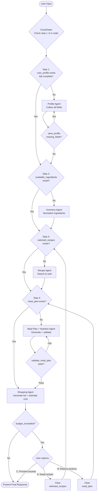
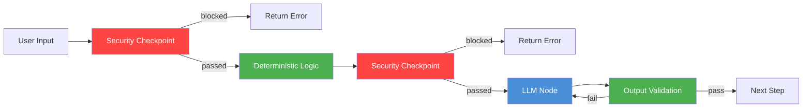

# System Workflows — ADK 2.0 Workflow Graph Architecture

## Purpose

Define the canonical orchestration blueprint for the meal-planner-assistant project. Every workflow, agent, tool, and MCP server must conform to this architecture.

## Workflow Graph

The root coordinator (`app/agent.py`) uses a single `instruction` prompt to sequence 6 sub-agents sequentially. Each step checks session state — if the required data already exists, it skips that step.



**Colour legend:**
- <span style="color:#e6e6fa">Lavender</span> — Orchestration / Decision
- <span style="color:#4a90d9">Blue</span> — Agent step (LLM)
- <span style="color:#ff9800">Orange</span> — User decision point
- <span style="color:#ff6347">Red-orange</span> — Clear session state (loop back)

## Workflow Specification

> The tables below describe the **business logic** of each step. The "Nodes" and "Human Approval" columns reference a planned Workflow Graph with Security Checkpoints — these are not yet implemented in the current prompt-based coordinator. All other columns (Inputs, Outputs, Validation, Failure Handling, Retry Strategy) reflect the current behaviour accurately.


### 1. User Onboarding Workflow

| Field | Content |
|-------|---------|
| Purpose | Collect initial user information |
| Trigger | First user message in a new session |
| Inputs | Free-form user text |
| Outputs | `session_state["user_profile"]` (partial) |
| Nodes | Security Checkpoint → Deterministic Input Validation → LLM Profile Extraction → Human Confirm |
| Edges | On failure → return error; On rejection → loop back to LLM |
| Validation Checkpoints | Input validation: age, height, weight ranges |
| Human Approval | RequestInput: confirm extracted profile |
| Failure Handling | Missing fields → ask user; Invalid ranges → return structured error |
| Retry Strategy | 3 attempts per field, then escalate |
| **LLM steps** | Preference extraction from natural language |
| **No-LLM steps** | Age/height/weight range checks, gender validation, activity level validation |

### 2. Inventory Workflow

| Field | Content |
|-------|---------|
| Purpose | Normalize and validate available ingredients |
| Trigger | User provides ingredient list |
| Inputs | `session_state["_last_user_message"]`, `session_state["user_profile"]` |
| Outputs | `session_state["available_ingredients"]` (normalized list of dicts) |
| Nodes | Security Checkpoint → Deterministic Inventory Normalization → RequestInput |
| Edges | Ambiguous quantity → RequestInput clarification; Unrecognized ingredient → reject with message |
| Validation Checkpoints | All names resolved via `normalize_ingredient_name`; All units resolved via `UNIT_ALIASES` |
| Human Approval | RequestInput: confirm ambiguous quantities |
| Failure Handling | Unrecognized → return error message with suggestions |
| Retry Strategy | None — deterministic, no retry needed |
| **LLM steps** | None — purely deterministic |
| **No-LLM steps** | Parse free-form text, resolve aliases, normalize units, merge duplicates, detect unknowns |

### 3. Recipe Recommendation Workflow

| Field | Content |
|-------|---------|
| Purpose | Rank and recommend recipes based on available ingredients and preferences |
| Trigger | Inventory confirmed |
| Inputs | `session_state["user_profile"]`, `session_state["available_ingredients"]` |
| Outputs | `session_state["selected_recipes"]` (list of recipe dicts) |
| Nodes | Security Checkpoint → Deterministic Allergy/Availability Filter → LLM Ranking → Deterministic Output Validation → RequestInput |
| Edges | No matches → return "no matching recipes"; User rejects → loop to LLM; Validation fails → loop to LLM |
| Validation Checkpoints | No allergens present; All recipes exist in RECIPES_DB; Nutrition data calculated |
| Human Approval | RequestInput: accept top N recipes or reject |
| Failure Handling | No recipes match available ingredients → suggest shopping; LLM timeout → return top 3 by availability score |
| Retry Strategy | LLM: 3 attempts with fallback to deterministic ranking |
| **LLM steps** | Recipe ranking with explanation, portion adjustment suggestions |
| **No-LLM steps** | Allergy filtering, ingredient availability scoring (35% weight), preference matching (25% weight), nutrition alignment (20%), time scoring (10%), diversity scoring (10%) |

### 4. Nutrition Analysis Workflow

| Field | Content |
|-------|---------|
| Purpose | Calculate nutritional content of recipes and validate against targets |
| Trigger | Recipes selected |
| Inputs | `session_state["selected_recipes"]`, `session_state["user_profile"]` |
| Outputs | `session_state["nutrition_validation"]` (per-recipe and per-meal validation) |
| Nodes | Security Checkpoint → Deterministic Nutrition Calculation → Deterministic Validation |
| Edges | Validation fails → route to Meal Plan Adjustment; Pass → proceed |
| Validation Checkpoints | All ingredients resolved in NUTRITION_DB; Units converted correctly |
| Human Approval | None — fully automatic |
| Failure Handling | Missing NUTRITION_DB entry → flag as unknown, continue with available data |
| Retry Strategy | None — deterministic, no retry needed |
| **LLM steps** | None — purely deterministic |
| **No-LLM steps** | `calculate_recipe_nutrition()`, `validate_meal_plan()`, unit conversion, macro target comparison |

### 5. Meal Planning Workflow

| Field | Content |
|-------|---------|
| Purpose | Generate daily or weekly meal plan meeting nutritional targets |
| Trigger | Nutrition validated or user requests meal plan |
| Inputs | `session_state["user_profile"]`, `session_state["selected_recipes"]`, `session_state["available_ingredients"]` |
| Outputs | `session_state["meal_plan"]` (list of day dicts with meals and nutrition) |
| Nodes | Security Checkpoint → Deterministic Recipe Distribution → Deterministic Plan Generation → Deterministic Validation → [LLM Portion Adjustment → Deterministic Re-generation → Deterministic Re-validation] loop → RequestInput |
| Edges | Validation pass → RequestInput; Validation fail → LLM adjustment loop (max 3); User rejects → LLM re-plan |
| Validation Checkpoints | Calorie 10% tolerance; Macro targets; No allergens; No duplicate meals within a day |
| Human Approval | RequestInput: accept plan or request changes |
| Failure Handling | Validation loop exceeds 3 attempts → return best-effort plan with warnings |
| Retry Strategy | Portion adjustment: 3 LLM calls then accept best effort |
| **LLM steps** | Portion adjustment reasoning, recipe substitution suggestions, meal diversity evaluation |
| **No-LLM steps** | Recipe-to-meal-slot distribution, nutrition summation, `validate_meal_plan()` tolerance check, duplicate detection |

### 6. Shopping Optimization Workflow

| Field | Content |
|-------|---------|
| Purpose | Generate cost-optimized shopping list |
| Trigger | Meal plan accepted |
| Inputs | `session_state["meal_plan"]`, `session_state["user_profile"]`, `session_state["available_ingredients"]` |
| Outputs | `session_state["shopping_list"]` (list of ShoppingListItem dicts) |
| Nodes | Security Checkpoint → Deterministic Merge/Cost → RequestInput (budget check) |
| Edges | Over budget → return to merge with alternative pricing; Accept → proceed |
| Validation Checkpoints | All prices resolved in PRICE_DB; Budget comparison executed |
| Human Approval | RequestInput: confirm list or accept over-budget alternatives |
| Failure Handling | PRICE_DB missing entry → flag as unknown cost; Budget exceeded → suggest alternatives |
| Retry Strategy | None — deterministic, no retry needed |
| **LLM steps** | None — purely deterministic |
| **No-LLM steps** | `generate_optimized_shopping_list()`, `estimate_grocery_cost()`, duplicate merging, available-stock subtraction, category grouping |

### 7. Weekly Planning Workflow

| Field | Content |
|-------|---------|
| Purpose | Extend meal plan across a full week with recipe rotation |
| Trigger | User selects `planning_mode=weekly` |
| Inputs | `session_state["user_profile"]`, `session_state["selected_recipes"]` |
| Outputs | `session_state["meal_plan"]` (7 days) |
| Nodes | Security Checkpoint → Deterministic Rotation Algorithm → LLM Diversity Check → RequestInput |
| Edges | Diversity check fails → re-rotate |
| Validation Checkpoints | 7 days present; No recipe repeated more than 2x/week; Daily nutrition validated |
| Human Approval | RequestInput: accept weekly plan or regenerate |
| Failure Handling | Not enough unique recipes → suggest supplementing with similar recipes |
| Retry Strategy | Rotation: 2 attempts; Diversity check: 2 LLM calls |
| **LLM steps** | Semantic diversity evaluation across cuisine types |
| **No-LLM steps** | Recipe rotation algorithm, nutrition carry-over from daily plan, duplicate prevention |

## Security Checkpoint Specification

The Security Checkpoint is a deterministic Python node that runs before every LLM-powered node and on initial user input.

### Node Interface

```
Input:  session_state dict (or subset)
Output: SecurityCheckpointResult {passed, blocked, events[], sanitized_data?, validation_errors[]}
```

If `blocked=True`, the workflow must NOT proceed to the LLM. The result should be returned to the user as a structured error.

### Node Placement



### Checks Performed

| Check | Module | Step Trigger | Block or Sanitize |
|-------|--------|-------------|-------------------|
| Input Validation | `validate_input()` | all steps | Block (invalid data) |
| PII Detection & Redaction | `sanitize_sensitive_data()` | profile, recipe, shopping | Sanitize (redact in copy) |
| Prompt Injection | `detect_prompt_injection()` | all steps | Block |
| Business Rules | `validate_business_rules()` | profile, recipe, meal plan | Block |
| Inventory Validation | `validate_inventory()` | inventory step | Block (unrecognized) |
| Output Validation | `validate_output()` | after LLM | Block or regenerate |

### Integration Points

In the Workflow Graph, the Security Checkpoint is inserted as a function node:

```python
from app.tools.security_checkpoint import run_security_checkpoint

# Example: before LLM recipe ranking
def recipe_security_gate(ctx: WorkflowContext) -> NodeResult:
    result = run_security_checkpoint(ctx.session_state, step="recipe")
    if result.blocked:
        return NodeResult(error=result.validation_errors)
    if result.sanitized_data:
        ctx.session_state.update(result.sanitized_data)
    return NodeResult(data=result)
```

## Multi-Agent Orchestration

### Execution Order

```
Profile → Inventory → Recipe → Nutrition → Meal Plan → Shopping
```

Each step is a sub-workflow in the Workflow Graph. Steps execute sequentially — a step cannot start until the previous step's Human Approval or Output Validation passes.

### Shared Context

All agents communicate through `session_state` (the ADK `WorkflowContext`). Keys follow lowercase snake_case:

| Key | Written By | Read By | Type |
|-----|-----------|---------|------|
| `user_profile` | Onboarding, Profile | All downstream | dict (UserProfile schema) |
| `available_ingredients` | Inventory | Recipe, Meal Plan, Shopping | list[dict] |
| `requested_ingredients` | Inventory | Recipe | list[dict] |
| `selected_recipes` | Recipe | Meal Plan, Nutrition, Shopping | list[dict] |
| `meal_plan` | Meal Plan | Nutrition, Shopping | list[dict] |
| `nutrition_validation` | Nutrition | Meal Plan (validation loop) | dict |
| `shopping_list` | Shopping | — | list[ShoppingListItem] |
| `_last_user_message` | Router | Security Checkpoint | str |

### Communication Rules

1. Agents never call other agents directly — the Workflow Graph handles routing
2. Agents never read or write outside their declared keys
3. The Security Checkpoint may read any key but only writes sanitized copies
4. Human-in-the-loop nodes (`RequestInput`) are inserted by the Workflow Graph, not by agents

### Routing Decisions

All branching is handled by `ConditionalEdge` in the Workflow Graph:

```python
graph.add_conditional_edges(
    source="meal_plan_validation",
    condition=lambda ctx: "retry" if ctx.state.get("validation_retries", 0) < 3 else "accept",
    mapping={"retry": "llm_adjust_portions", "accept": "human_approve_plan"},
)
```

### Cancellation Behavior

- User can cancel at any `RequestInput` node
- Cancellation clears the current sub-workflow state but preserves upstream data
- The graph returns to a neutral state and waits for new user input

### Retry Behavior

- LLM nodes: max 3 retries with exponential backoff (1s, 2s, 4s)
- Validation loops: max 3 regeneration attempts
- Security Checkpoint: no retry — either pass or block immediately

## Human-in-the-Loop Points

| Point | Workflow | Display Strategy | Node Type |
|-------|----------|-----------------|-----------|
| Confirm extracted profile | Onboarding | Structured summary with editable fields | `RequestInput` |
| Confirm ingredient quantities | Inventory | Inline correction for ambiguous items | `RequestInput` |
| Accept/reject recipe recommendations | Recipe | Numbered list with reasons per recipe | `RequestInput` |
| Accept/reject meal plan | Meal Plan | Daily breakdown card with nutrition table | `RequestInput` |
| Confirm shopping list | Shopping | Categorized list with total cost | `RequestInput` |
| Budget overage decision | Shopping | Current cost vs budget with swap suggestions | `RequestInput` |

## Deterministic vs LLM Responsibilities

| Responsibility | Module | Deterministic | LLM | Reason |
|---------------|--------|:---:|:---:|--------|
| Age/height/weight range validation | `security_checkpoint.validate_input` | ✓ | | Exact comparison |
| Ingredient name normalization | `normalize_ingredients` | ✓ | | Alias lookup |
| Unit resolution | `normalize_ingredients` | ✓ | | UNIT_ALIASES mapping |
| Allergy filtering | Recipe agent (availability scoring) | ✓ | | Set exclusion |
| Ingredient availability scoring | Recipe agent (35% weight) | ✓ | | Percentage calculation |
| Nutrition calculation | `calculate_recipe_nutrition` | ✓ | | Exact arithmetic |
| Meal plan validation (10% tolerance) | `meal_plan_validator` | ✓ | | Exact comparison |
| Shopping list merge/dedup | `shopping_list` | ✓ | | Set logic |
| Cost estimation | `cost_estimator` | ✓ | | Lookup + multiplication |
| Budget checking | `cost_estimator` | ✓ | | Comparison |
| PII detection | `security_checkpoint.sanitize_sensitive_data` | ✓ | | Regex patterns |
| Prompt injection detection | `security_checkpoint.detect_prompt_injection` | ✓ | | Pattern matching |
| Preference extraction from text | Onboarding workflow | | ✓ | NLU required |
| Recipe ranking explanation | Recipe workflow | | ✓ | Semantic reasoning |
| Portion adjustment reasoning | Meal Plan workflow | | ✓ | Contextual judgment |
| Ingredient substitution suggestion | Meal Plan workflow | | ✓ | Domain knowledge |
| Meal diversity evaluation | Weekly Planning workflow | | ✓ | Semantic comparison |
| Friendly summary generation | All workflows | | ✓ | NLG |

## State Management

### Workflow State

ADK 2.0 `WorkflowState` tracks:
- Current node ID
- Node execution status (`pending`, `running`, `completed`, `failed`, `blocked`)
- Error information per node
- Retry count per node

### Session State (WorkflowContext)

Typed session state keys (formalized from current dict-based approach):

| Field | Type | Persistence | Security |
|-------|------|-------------|----------|
| `user_profile` | `UserProfile` Pydantic model | Session | Sanitized before LLM |
| `available_ingredients` | `list[NormalizedIngredient]` | Session | Validated + normalized |
| `requested_ingredients` | `list[NormalizedIngredient]` | Session | Validated |
| `selected_recipes` | `list[Recipe]` with `NutritionInfo` | Session | Allergy-checked |
| `meal_plan` | `list[MealPlanDay]` | Session | Output-validated |
| `nutrition_validation` | `NutritionValidation` | Session | — |
| `shopping_list` | `list[ShoppingListItem]` | Session | Budget-checked |
| `planning_mode` | `Literal["daily", "weekly"]` | Session | Validated |

### Persistent Memory

- **DuckDB** (future): user profiles, inventory history, meal plan history
- **Current**: in-memory dicts in `app/data/stores.py`

### Workflow Checkpoints

The Workflow Graph automatically checkpoints at each completed node. On session recovery:
- Resume from the last completed node
- Re-run the Security Checkpoint before resuming LLM execution
- Human approval nodes are re-presented if not yet confirmed

## Error Recovery

| Failure Type | Detection | Strategy | Max Retries | Fallback |
|-------------|-----------|----------|-------------|----------|
| Invalid input | `validate_input()` | Return structured error | 0 | Request corrected input |
| PII detected | `sanitize_sensitive_data()` | Redact + continue | 0 | Sanitized copy to LLM |
| Prompt injection | `detect_prompt_injection()` | Block + log | 0 | Return security notice |
| Business rule violation | `validate_business_rules()` | Block with reason | 0 | Return validation error |
| Unrecognized ingredient | `validate_inventory()` | Block with suggestions | 0 | Request replacement |
| LLM timeout | Graph node timeout (30s) | Exponential backoff: 1s, 2s, 4s | 3 | Deterministic fallback ranking |
| LLM invalid output | `validate_output()` | Regenerate | 3 | Accept best-effort with warnings |
| Session state missing | KeyError guard | Halt with message | 0 | Request restart |
| MCP timeout (future) | Circuit breaker (5s) | Retry | 2 | In-memory fallback data |

## MCP Integration

MCP servers are the boundary layer for external data. Agents never call external APIs directly — they use tools that call MCP servers.

| MCP Server | Workflows | Data Provided | Status |
|------------|-----------|---------------|--------|
| Nutrition MCP | Nutrition Analysis, Meal Planning | Per-100g nutrition data | Not yet implemented |
| Recipe MCP | Recipe Recommendation | Recipe search, dietary tags | Not yet implemented |
| Grocery Pricing MCP | Shopping Optimization | Real-time prices | Not yet implemented |
| Inventory MCP (future) | Inventory, Shopping | Persistent user inventory | Not yet implemented |

All MCP calls route through Security Checkpoint for input validation before the request and output validation on the response.

## Workflow Expansion

### Extension Pattern

To add a new workflow (e.g., Fitness Planning, AI Cooking Assistant):

1. **Create agent**: `app/agents/<new_agent>.py` following `rules/agents.md`
2. **Create tools**: `app/tools/` for any new deterministic logic
3. **Create workflow nodes**: Add nodes to the Workflow Graph
4. **Wire edges**: Use `graph.add_edge()` or `graph.add_conditional_edges()`
5. **Add Security Checkpoint**: Insert before any LLM node in the new workflow
6. **Update coordinator**: If the new workflow is triggered by user intent, add routing in the root router
7. **No existing code changes required** — the graph supports adding nodes without modifying existing edges

### Example: Adding a Fitness Planning Workflow

```python
from app.agents.fitness import create_fitness_agent
from app.tools.security_checkpoint import run_security_checkpoint

# Add a parallel track to the main graph:
# meal_planner_graph → fitness_planner_graph (parallel, user chooses)

fitness_agent = create_fitness_agent()

fitness_sc_node = FunctionNode(
    name="fitness_security_check",
    fn=lambda ctx: run_security_checkpoint(ctx.session_state, step="fitness"),
)
fitness_llm_node = AgentNode(
    name="fitness_recommendation",
    agent=fitness_agent,
)

meal_planner_graph.add_edge("user_profile", "fitness_security_check")
meal_planner_graph.add_edge("fitness_security_check", "fitness_recommendation")
```

### Constraints on Expansion

- Every LLM node must be preceded by a Security Checkpoint node
- New session state keys must follow `lowercase_snake_case` convention
- New agents must have a single focused responsibility with a narrow tool surface
- New workflows must not create circular dependencies with existing workflows

## Migration Path

### Phase 1 — Add Security Checkpoint (current)
Deploy `app/tools/security_checkpoint.py` as a standalone module. Agents can call it before LLM work. This provides immediate safety without refactoring the coordinator.

### Phase 2 — Introduce Workflow Graph
Replace the coordinator's `instruction` prompt with a `WorkflowGraph`. Each sub-agent becomes a `WorkflowNode`. The Security Checkpoint nodes are inserted between every deterministic → LLM transition.

### Phase 3 — Formalize Typed Context
Migrate `session_state` dicts to Pydantic models defined in `app/models/schemas.py`. Update all tools to work with typed inputs. The `WorkflowContext` wraps these models for type-safe access.

### Phase 4 — Add MCP Servers
Implement Nutrition MCP, Recipe MCP, and Grocery Pricing MCP. Update tools to call MCPs instead of in-memory dicts. The Security Checkpoint validates all MCP inputs and outputs.

## Reference

- `app/tools/security_checkpoint.py` — Security Checkpoint implementation
- `app/tools/calculate_nutrition.py` — Deterministic nutrition calculation
- `app/tools/meal_plan_validator.py` — Deterministic meal plan validation
- `app/tools/normalize_ingredients.py` — Deterministic ingredient normalization
- `app/tools/shopping_list.py` — Deterministic shopping list generation
- `app/tools/cost_estimator.py` — Deterministic cost estimation
- `app/models/schemas.py` — Pydantic models for typed session state
- `rules/architecture.md` — Architecture rules
- `rules/agents.md` — Agent definition standards
- `rules/security.md` — Security policies
- `skills/development/create-workflow.md` — Workflow development skill
